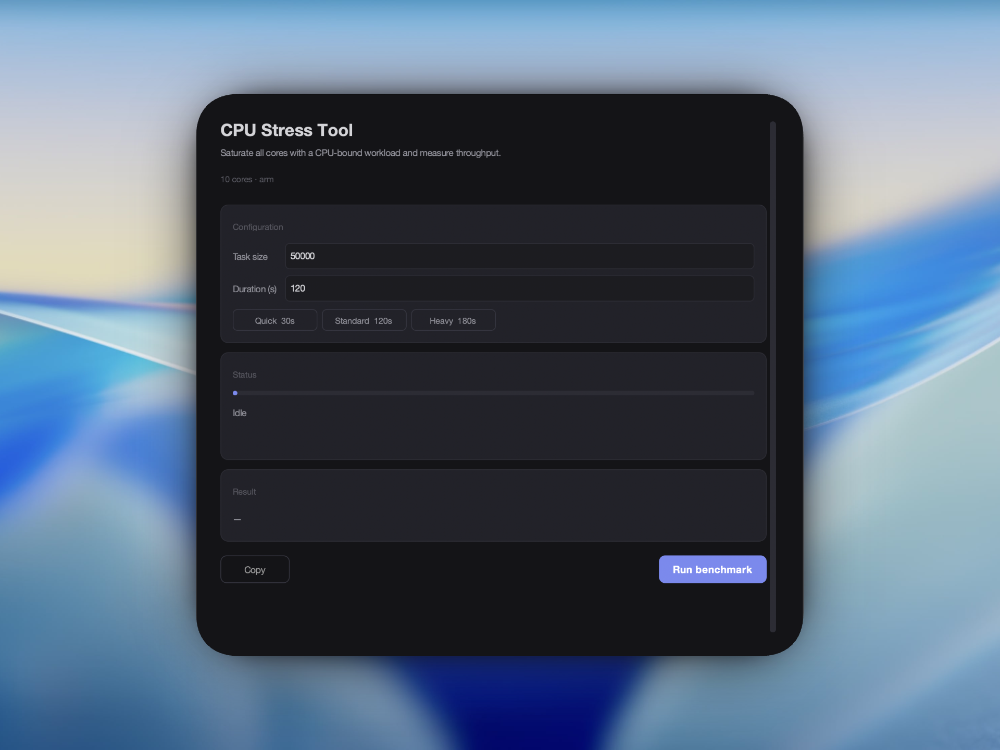

# CPU Stress Test Tool



**Version:** v2.0.0

A Python-based graphical tool to benchmark your system's CPU performance by running intensive computational tasks across all cores.

## Features

- Stress test all CPU cores using a customizable workload.
- Adjustable parameters for:
  - Task size (work units per iteration).
  - Test duration.
- Real-time progress with a live elapsed / remaining timer.
- Cancel a running benchmark at any time.
- Performance metrics:
  - Tasks completed per second.
  - Total tasks completed.
  - Total execution time.
- Copy results as a markdown table row for easy sharing.
- Keyboard shortcuts: **Enter** to start, **Escape** to cancel.

## Requirements

- Python 3.8+
- [customtkinter](https://github.com/TomSchimansky/CustomTkinter)

## How to Run

1. Clone the repository:

   ```bash
   git clone "https://github.com/Divyansh2903/cpu-stress-test.git"
   cd cpu-stress-test
   ```

2. Install dependencies:

   ```bash
   pip install -r requirements.txt
   ```

3. Run the program:

   ```bash
   python main.py
   ```

## How the Benchmark Works

The benchmark measures **CPU throughput** by repeatedly running a fixed, CPU-bound workload on **all available CPU cores** for a user-selected duration.

- **Inputs (validated ranges)**:
  - **Task size**: 50,000–100,000
  - **Duration**: 10–3,600 seconds
- **Presets (for reproducible runs)**:
  - **Quick**: Task size 50,000 for 30s
  - **Standard**: Task size 50,000 for 120s
  - **Heavy**: Task size 100,000 for 180s
- **Workload**: each “task” runs `intensive_task(work_units)` — a tight loop of 64-bit integer mixing operations for `work_units` iterations (bounded arithmetic to avoid big-int growth).
- **Parallelism**: the app starts a `ProcessPoolExecutor` with `max_workers = os.cpu_count()` (roughly **one worker process per core**) and dispatches one task per worker per batch.
- **Metric**:
  - **Total Tasks**: how many per-core tasks completed during the run.
  - **Tasks/sec**: \( \text{Total Tasks} / \text{Total Time} \).

Because each “task” is a fixed amount of CPU work (driven by **Task size**) and tasks are executed in separate processes, the result is a practical proxy for sustained multi-core CPU performance (with some overhead from process scheduling and inter-process coordination).

> For meaningful comparisons between machines, keep **Task size** and **Duration** the same. Changing Task size changes how much work a single “task” represents.

## Rough Performance Expectations

These are **very rough** ballparks for the **Standard** preset (Task size \(= 50{,}000\), Duration \(= 120\)s) on typical machines:

- **Modern Apple Silicon / high-end laptop CPUs**: ~350–550 tasks/sec
- **Mid-range 6–8 core laptops**: ~200–400 tasks/sec
- **Older 4-core laptops**: ~120–280 tasks/sec

Your number will vary with thermals, power mode, background load, and OS scheduling.

## Benchmark Comparison Table

This table shows CPU performance on various devices using the benchmarking tool.

> Note: The table was **reset in v2.0.0** because the workload/assessment method changed.

The test was conducted with the following default parameters:
- **Task Size:** 50,000
- **Duration:** 120 seconds

### Contribute Your Results

- Run the benchmark and click **Copy** — it puts a pre-filled markdown table row on your clipboard.
- Open a GitHub issue or submit a pull request with the updated table.
- The copied row includes your CPU (with core count) and detected RAM. Fill in `<device>`.

| Device               | CPU                | RAM (GB) | Tasks/sec | Total Tasks |
|----------------------|--------------------|----------|-----------|-------------|
|                      |                    |          |           |             |
